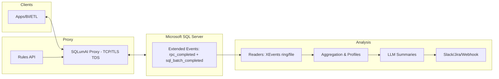

# SQLumAI
[](https://github.com/Caripson/SQLumAI/actions)
[](LICENSE)

SQLumAI is an invisible, AI‑powered proxy for Microsoft SQL Server.

For non‑technical readers
- What it does: Watches data flowing to SQL Server and helps improve data quality – without slowing anything down.
- How it helps: Finds missing values, inconsistent formats (dates, phone numbers), and process gaps; proposes fixes and simpler input rules; summarizes issues daily.
- Why it’s safe: It forwards traffic transparently by default (dry‑run). You control when to enforce rules.
- Where AI fits: A local LLM turns raw events into a short list of high‑value actions and insights.

Developed by Johan Caripson.

## Quick Start
- Docker: `docker compose up` (starts SQL Server + proxy + API).
- Local: `make setup` then `make dev`.
- Tests: `make test` (and `make coverage`).

## Capabilities (MVP 1–3)
- MVP 1 – Transparent pass‑through: TCP proxy + XEvents readers (`scripts/create_xevents.sql`, `scripts/read_xevents.py`, `scripts/read_xel_files.py`), aggregation + daily reports.
- MVP 2 – Normalization + feedback: `agents/normalizers.py` (date/phone/postal/email/country/orgnr), webhook feedback, LLM summaries.
- MVP 3 – Gatekeeper: Rules API + engine, env‑gating, thresholds; optional TLS termination + TDS parsing for SQL Batch/RPC; simple column‑level autocorrect; metrics, audits, dashboards.
  - Dry‑run vs enforce: `ENFORCEMENT_MODE=log|enforce`
  - Parsers: `ENABLE_TDS_PARSER=true`, `ENABLE_SQL_TEXT_SNIFF=true`
  - LLM: `LLM_PROVIDER`, `LLM_MODEL`, `LLM_ENDPOINT` (Ollama default), `OPENAI_API_KEY` (OpenAI-compatible)
  - Scheduler: `ENABLE_SCHEDULER`, `SCHEDULE_INTERVAL_SEC`
  - Docs overview: see `docs/mvp.md`

See `AGENTS.md` for contributor guidelines and development conventions.

## Architecture


Docs
- Browse docs in `docs/` or serve with `mkdocs serve`.
- MVPs: `docs/mvp.md`  |  Enforcement: `docs/ENFORCEMENT.md`  |  Architecture: `docs/architecture.md`
- LLM config/providers: `docs/llm-providers.md`  |  Insights: `docs/insights.md`
- Reports/Integration: `docs/howto-reports.md`, `docs/howto-integration.md`
- Metrics dashboard: `docs/metrics-dashboard.md`
- Test strategy: `docs/test-strategy.md`

## Nightly Scheduler (example)
Set these in your `.env` or environment to run the full pipeline hourly (or nightly by setting a longer interval):

```
ENABLE_SCHEDULER=true
SCHEDULE_INTERVAL_SEC=3600   # 1h; use 86400 for nightly

# SQL connection for XEvents readers
SQL_HOST=localhost
SQL_PORT=1433
SQL_USER=sa
SQL_PASSWORD=Your_strong_Pa55
SQL_DATABASE=master

# Optional: read XEL files produced by event_file target
XEL_PATH_PATTERN=C:\\ProgramData\\SQLumAI\\sqlumai_capture*.xel

# Optional: post daily summary to a webhook
FEEDBACK_WEBHOOK=
```

TLS termination for the proxy is optional. See `CERTS_README.md` for dev certs.

Metrics
- API exposes `/metrics` with simple counters: `allowed`, `autocorrect_suggested`, `blocks`.
- Dry-run report: `python scripts/generate_dryrun_report.py` writes `reports/dryrun-YYYY-MM-DD.md` (also run by scheduler).
 - Prometheus endpoint: `/metrics/prom` and Grafana dashboard via `make metrics-up`.

## License

MIT – see [LICENSE](LICENSE).

## Connection & DSN examples
- ODBC: `Driver={ODBC Driver 18 for SQL Server};Server=localhost,61433;Database=master;UID=sa;PWD=...;Encrypt=no;`
- ADO.NET: `Server=localhost,61433;Database=master;User Id=sa;Password=...;TrustServerCertificate=True;`
- JDBC: `jdbc:sqlserver://localhost:61433;databaseName=master;encrypt=false`

## XEvents cleanup (SQL)
Use the snippet below to stop and drop both sessions if needed (same logic exists in `scripts/drop_xevents.sql`).

```sql
IF EXISTS (SELECT * FROM sys.server_event_sessions WHERE name = 'sqlumai_capture')
BEGIN
  ALTER EVENT SESSION [sqlumai_capture] ON SERVER STATE = STOP;
  DROP EVENT SESSION [sqlumai_capture] ON SERVER;
END

IF EXISTS (SELECT * FROM sys.server_event_sessions WHERE name = 'sqlumai_capture_file')
BEGIN
  ALTER EVENT SESSION [sqlumai_capture_file] ON SERVER STATE = STOP;
  DROP EVENT SESSION [sqlumai_capture_file] ON SERVER;
END
```

## Normalization & Policy examples
- Normalize (MVP 2): use `agents/normalizers.py` for dates/phones/postal/emails. Example usage:

```python
from agents.normalizers import suggest_normalizations
assert suggest_normalizations("31/12/24")["normalized"] == "2024-12-31"
```

- Policy rules (MVP 3): managed via the Rules API and persisted in `config/rules.json`.

```json
[
  {"id":"phone-autocorrect","target":"column","selector":"dbo.Customers.Phone","action":"autocorrect","reason":"Normalize SE phone","confidence":0.95},
  {"id":"no-null-email","target":"column","selector":"dbo.Users.Email","action":"block","reason":"Email required","confidence":1.0},
  {"id":"deny-test-data","target":"pattern","selector":"INSERT INTO dbo.Orders","action":"block","reason":"No test orders in prod","confidence":0.9}
]
```

API examples:

```bash
curl -s http://localhost:8080/rules | jq .
curl -s -X POST http://localhost:8080/rules \
  -H 'Content-Type: application/json' \
  -d '{"id":"no-null-email","target":"column","selector":"dbo.Users.Email","action":"block","reason":"Email required","confidence":1.0}'
```
