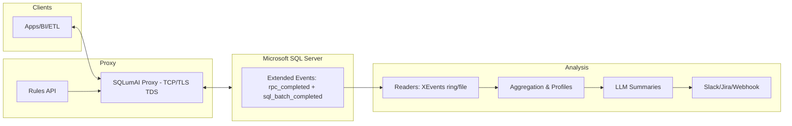

# SQLumAI
[](https://github.com/Caripson/SQLumAI/actions)
[](https://github.com/Caripson/SQLumAI/releases)
[](https://github.com/Caripson/SQLumAI/tags)
[](#)
[](LICENSE)

<p align="center">
  
  <br/>
  <em>Transparent AI proxy for Microsoft SQL Server</em>
  <br/>
  <sub>Developed by Johan Caripson</sub>
  <br/>
</p>

SQLumAI is an invisible, AI‑powered proxy for Microsoft SQL Server.

For non‑technical readers
- What it does: Watches data flowing to SQL Server and helps improve data quality – without slowing anything down.
- How it helps: Finds missing values, inconsistent formats (dates, phone numbers), and process gaps; proposes fixes and simpler input rules; summarizes issues daily.
- Why it’s safe: It forwards traffic transparently by default (dry‑run). You control when to enforce rules.
- Where AI fits: A local LLM turns raw events into a short list of high‑value actions and insights.

Developed by Johan Caripson.

Dependencies
-     

## Quick Start
- Docker: `docker compose up` (starts SQL Server + proxy + API).
- Local: `make setup` then `make dev`.
- Tests: `make test` (and `make coverage`).

## Capabilities (MVP 1–4)
- MVP 1 – Transparent pass‑through: TCP proxy + XEvents readers (`scripts/create_xevents.sql`, `scripts/read_xevents.py`, `scripts/read_xel_files.py`), aggregation + daily reports.
- MVP 2 – Normalization + feedback: `agents/normalizers.py` (date/phone/postal/email/country/orgnr), webhook feedback, LLM summaries.
- MVP 3 – Gatekeeper: Rules API + engine, env‑gating, thresholds; optional TLS termination + TDS parsing for SQL Batch/RPC; simple column‑level autocorrect; metrics, audits, dashboards.
  - Dry‑run vs enforce: `ENFORCEMENT_MODE=log|enforce`
  - Parsers: `ENABLE_TDS_PARSER=true`, `ENABLE_SQL_TEXT_SNIFF=true`
  - LLM: `LLM_PROVIDER`, `LLM_MODEL`, `LLM_ENDPOINT` (Ollama default), `OPENAI_API_KEY` (OpenAI-compatible)
  - Scheduler: `ENABLE_SCHEDULER`, `SCHEDULE_INTERVAL_SEC`
  - Docs overview: see `docs/mvp.md`

- MVP 4 – Enforcement + DX:
  - Broader SQL detectors: MERGE, BULK INSERT, simple SELECT analysis (counts of SELECT * and columns).
  - Extended RPC types in builder: DECIMAL/NUMERIC, DATE/TIME/DATETIME2/DATETIMEOFFSET, UNIQUEIDENTIFIER, VARBINARY.
  - New normalizers: `decimal`, `datetime`, `uuid` in `agents/normalizers.py`.
- Rules UI: browse and add rules at `/rules/ui`, with an inline “Test Decision” panel.
  - NL→Rule suggestion: `POST /rules/suggest` returns a proposed rule JSON from plain text.
  - XEvents helper API: `POST /xevents/setup?mode=ring|file` returns a ready-to-run SQL session script.
  - XEvents setup helper: `scripts/setup_xevents.py` renders a session SQL for ring buffer or file targets.
  - Secrets provider: `src/runtime/secrets.py` with `SECRET_PROVIDER=env|file`.

See `AGENTS.md` for contributor guidelines and development conventions.

## Architecture


Docs
- Browse docs in `docs/` or serve with `mkdocs serve`.
- MVPs: `docs/mvp.md`  |  Enforcement: `docs/ENFORCEMENT.md`  |  Architecture: `docs/architecture.md` | HA: `docs/ha.md`
- LLM config/providers: `docs/llm-providers.md`  |  Insights: `docs/insights.md`
- Reports/Integration: `docs/howto-reports.md`, `docs/howto-integration.md`
- Metrics dashboard: `docs/metrics-dashboard.md`
 - High availability: `docs/ha.md`
- Test strategy: `docs/test-strategy.md`
 - Helper scripts: `scripts/README.md`

## Nightly Scheduler (example)
Set these in your `.env` or environment to run the full pipeline hourly (or nightly by setting a longer interval):

```
ENABLE_SCHEDULER=true
SCHEDULE_INTERVAL_SEC=3600   # 1h; use 86400 for nightly

# SQL connection for XEvents readers
SQL_HOST=localhost
SQL_PORT=1433
SQL_USER=sa
SQL_PASSWORD=Your_strong_Pa55
SQL_DATABASE=master

# Optional: read XEL files produced by event_file target
XEL_PATH_PATTERN=C:\\ProgramData\\SQLumAI\\sqlumai_capture*.xel

# Optional: post daily summary to a webhook
FEEDBACK_WEBHOOK=
```

TLS termination for the proxy is optional. See `CERTS_README.md` for dev certs.

Metrics
- API exposes `/metrics` with simple counters: `allowed`, `autocorrect_suggested`, `blocks`.
- Dry-run report: `python scripts/generate_dryrun_report.py` writes `reports/dryrun-YYYY-MM-DD.md` (also run by scheduler).
 - Prometheus endpoint: `/metrics/prom` and Grafana dashboard via `make metrics-up`.

## License

MIT – see [LICENSE](LICENSE).

## Connection & DSN examples
- ODBC: `Driver={ODBC Driver 18 for SQL Server};Server=localhost,61433;Database=master;UID=sa;PWD=...;Encrypt=no;`
- ADO.NET: `Server=localhost,61433;Database=master;User Id=sa;Password=...;TrustServerCertificate=True;`
- JDBC: `jdbc:sqlserver://localhost:61433;databaseName=master;encrypt=false`

## XEvents cleanup (SQL)
Use the snippet below to stop and drop both sessions if needed (same logic exists in `scripts/drop_xevents.sql`).

```sql
IF EXISTS (SELECT * FROM sys.server_event_sessions WHERE name = 'sqlumai_capture')
BEGIN
  ALTER EVENT SESSION [sqlumai_capture] ON SERVER STATE = STOP;
  DROP EVENT SESSION [sqlumai_capture] ON SERVER;
END

IF EXISTS (SELECT * FROM sys.server_event_sessions WHERE name = 'sqlumai_capture_file')
BEGIN
  ALTER EVENT SESSION [sqlumai_capture_file] ON SERVER STATE = STOP;
  DROP EVENT SESSION [sqlumai_capture_file] ON SERVER;
END
```

## Normalization & Policy examples
- Normalize (MVP 2): use `agents/normalizers.py` for dates/phones/postal/emails. Example usage:

```python
from agents.normalizers import suggest_normalizations
assert suggest_normalizations("31/12/24")["normalized"] == "2024-12-31"
assert suggest_normalizations("1\u00a0234,50")["normalized"] == "1234.50"
```

- Policy rules (MVP 3): managed via the Rules API and persisted in `config/rules.json`.

```json
[
  {"id":"phone-autocorrect","target":"column","selector":"dbo.Customers.Phone","action":"autocorrect","reason":"Normalize SE phone","confidence":0.95},
  {"id":"no-null-email","target":"column","selector":"dbo.Users.Email","action":"block","reason":"Email required","confidence":1.0},
  {"id":"deny-test-data","target":"pattern","selector":"INSERT INTO dbo.Orders","action":"block","reason":"No test orders in prod","confidence":0.9}
]
```

API examples:

```bash
curl -s http://localhost:8080/rules | jq .
# Minimal UI and test panel
open http://localhost:8080/rules/ui
curl -s -X POST http://localhost:8080/rules \
  -H 'Content-Type: application/json' \
  -d '{"id":"no-null-email","target":"column","selector":"dbo.Users.Email","action":"block","reason":"Email required","confidence":1.0}'

# Suggest a rule from natural language (stub)
curl -s -X POST http://localhost:8080/rules/suggest \
  -H 'Content-Type: application/json' \
  -d '{"text":"Alla svenska telefonnummer ska normaliseras"}' | jq .
```

## Usage Scenarios: BSS, Booking, ServiceNow, CRM

This section outlines practical flows and how SQLumAI can be used across business systems. Focus areas are data quality, process gaps, and how a local LLM turns raw events into a short list of high‑value actions and insights — without sending data externally.

### Where AI Fits
- Observability: The proxy and XEvents collect raw events (SQL Batch/RPC, and field values when available at the edge).
- Normalization: Rules and normalizers suggest simple fixes (phone, date, email) before data reaches the database.
- Aggregation: Jobs profile fields daily and build aggregates (top‑N, null ratios, frequency of errors).
- Local LLM Summary: A local model (Ollama/llama3.2 by default) reads profiles + events and produces a short list of:
  - Actions (“add simple validation in form X”, “normalize field Y”, “block pattern Z in prod”),
  - Insights (“30% of bookings miss email in channel A”, “test data in prod table T”, “SLA risk for incident type Q”).
- Feedback: Insights can go to a webhook (Slack/Jira/ServiceNow integration) or land as reports under `reports/`.

Principles:
- Local‑first: No data is sent to external LLMs by default. Ollama runs locally.
- Dry‑run by default: The proxy doesn’t block — it logs and suggests. You decide when to enforce.
- Simple rules: The LLM suggests, humans approve; rules live in `config/rules.json` and are auditable in Git.

### BSS (Business Support System)
- Typical issues:
  - Inconsistent customer data (phone, email, address), missing fields on onboarding, invalid organization IDs.
  - UI “workarounds” in CRM/BSS leading to inconsistent customer and subscription records.
- Data capture:
  - The TDS proxy sees `INSERT/UPDATE` on tables like `dbo.Customers`, `dbo.Subscriptions`, and RPC calls used in onboarding flows.
  - XEvents capture broader coverage for batch/ETL sources that bypass the proxy.
- Rules (example):
```json
[
  {"id":"bss-phone-autocorrect","target":"column","selector":"dbo.Customers.Phone","action":"autocorrect","reason":"Normalize E.164","confidence":0.9},
  {"id":"bss-email-required","target":"column","selector":"dbo.Customers.Email","action":"block","reason":"Email required at onboarding","confidence":1.0},
  {"id":"bss-no-test-subs","target":"pattern","selector":"INSERT INTO dbo.Subscriptions","action":"block","reason":"Stoppa testabonnemang i prod","confidence":0.9}
]
```
- LLM insights (examples):
  - “17% of new customers miss email in ‘retail‑tablet’ channel — add simple UI validation.”
  - “Most common error: phone format; autocorrect normalizes 62% to E.164.”
  - “Propose rule: block INSERT on Subscriptions with dummy domains (@test.local).”

### Booking systems
- Typical issues:
  - Double bookings, invalid time ranges, missing customer fields, unclear cancellation reasons.
- Rules (example):
```json
[
  {"id":"booking-no-overlap","target":"pattern","selector":"INSERT INTO dbo.Bookings","action":"block","reason":"Overlapping times must be prevented in app logic","confidence":0.8},
  {"id":"booking-email-format","target":"column","selector":"dbo.Bookings.Email","action":"autocorrect","reason":"Korrigera vanliga typos","confidence":0.7}
]
```
- LLM insights (examples):
  - “5% of bookings have end < start in ‘kiosk’ channel — fix UI.”
  - “Propose auto‑reply: confirm cancellations with a standard message to reduce manual tickets.”
  - “Add a simple business rule: block re‑book within 2 minutes (mis‑tap).”

### ServiceNow (ITSM/Tickets)
- Typical issues:
  - Missing fields (CI, impact, contact), wrong categorization, low data quality in manually created tickets.
  - Hard to see where flow leaks (e.g., tickets bouncing between groups).
- Rules (example):
```json
[
  {"id":"sn-caller-required","target":"column","selector":"dbo.Incidents.Caller","action":"block","reason":"Caller must be set","confidence":1.0},
  {"id":"sn-category-autocorrect","target":"column","selector":"dbo.Incidents.Category","action":"autocorrect","reason":"Normalize free text to known categories","confidence":0.8}
]
```
- LLM insights (examples):
  - “Incident type ‘VPN’ misses CI in 28% — update portal form with required field.”
  - “Queue ‘ServiceDesk L1’ often bounces to ‘Network’ and back. Add a rule: auto‑categorize when description matches ‘AnyConnect’.”
  - “Forecast: SLA risk increases week 42 due to higher email inflow.”

### CRM
- Typical issues:
  - Duplicates, incomplete leads, invalid domains, missing GDPR consent flags, unrealistic pipeline values.
- Rules (example):
```json
[
  {"id":"crm-email-normalize","target":"column","selector":"dbo.Leads.Email","action":"autocorrect","reason":"Correct common email domain typos","confidence":0.7},
  {"id":"crm-consent-required","target":"column","selector":"dbo.Leads.Consent","action":"block","reason":"Consent required for outreach","confidence":1.0}
]
```
- LLM insights (examples):
  - “10% of leads miss country code — propose autofill based on phone prefix.”
  - “Suggest cleanup: 420 duplicates in SME segment (match on email+org ID).”
  - “Add pipeline rule: block probability > 0.9 if ‘deal size’ < 1,000 (data quality smell).”

### End‑to‑end in dev
1) Start the stack: `docker compose -f compose.yml -f compose.ci.yml up -d --build` (proxy + SQL + Ollama).
2) Add a simple rule via API:
```bash
curl -s -X POST http://localhost:8080/rules \
  -H 'Content-Type: application/json' \
  -d '{"id":"phone-autocorrect","target":"column","selector":"Phone","action":"autocorrect","reason":"Normalize SE phone","confidence":0.9}'
```
3) Create a minimal demo database (examples in `docs/howto-integration.md`).
4) Run a few queries via the proxy (port 61433), open `http://localhost:8080/metrics.html` and `http://localhost:8080/dryrun.html`.
5) Generate reports: `python scripts/generate_daily_report.py` and `python scripts/llm_summarize_profiles.py`.

Production tips:
- Start in “log” (dry‑run). Build trust, measure effects in `/metrics`, adjust rules.
- When confident: set `ENFORCEMENT_MODE=enforce` and start enforcing in a limited scope (e.g., only certain tables/columns).
- Publish insights: set `FEEDBACK_WEBHOOK` to send reports to Slack/Jira/ServiceNow (via a small connector service).
