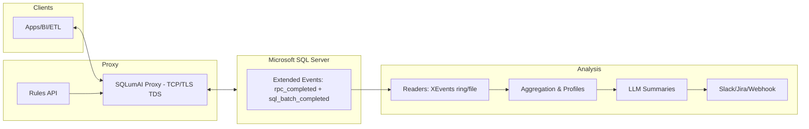

# SQLumAI
SQLumAI is an invisible, AI-powered proxy for Microsoft SQL Server.  
It forwards all queries without delay, while capturing snapshots of requests and responses.  
These snapshots are analyzed by a local LLM to uncover missing data, detect format issues,  
highlight process gaps, and generate actionable insights – without ever blocking traffic.

## Quick Start
- Docker: `docker compose up` (starts SQL Server + proxy + API).
- Local: `make setup` then `make dev`.
- Tests: `make test` (and `make coverage`).

## Capabilities
- MVP 1 – Transparent pass‑through: `src/proxy/tds_proxy.py`, XEvents capture (`scripts/create_xevents.sql`), readers, aggregation, daily reports.
- MVP 2 – Normalization + feedback: `agents/normalizers.py`, webhook publisher, simple catalogue via SQL parsing in aggregations.
- MVP 3 – Gatekeeper scaffolding: rules API (`src/api.py`), policy engine (`src/policy/engine.py`), optional TLS termination (`src/proxy/tds_tls.py`), TDS header parsing (`src/tds/parser.py`).
  - Inline enforcement (pattern-based): enable `ENABLE_SQL_TEXT_SNIFF=true` and set `ENFORCEMENT_MODE=enforce` to block by rule match; metrics exposed at `/metrics`.
  - SQL Batch rewrite (simple): enable `ENABLE_TDS_PARSER=true` for column-level autocorrect/block on INSERT/UPDATE; multi-row INSERT supported.
  - RPC NVARCHAR autocorrect (in-place): enable `RPC_AUTOCORRECT_INPLACE=true` (safe only when normalized value length ≤ original).

See `AGENTS.md` for contributor guidelines and development conventions.

## Architecture


Docs
- Browse docs in `docs/` or serve with `mkdocs serve` (see `mkdocs.yml`).
 - LLM config and providers: see `docs/llm-providers.md`.

## Nightly Scheduler (example)
Set these in your `.env` or environment to run the full pipeline hourly (or nightly by setting a longer interval):

```
ENABLE_SCHEDULER=true
SCHEDULE_INTERVAL_SEC=3600   # 1h; use 86400 for nightly

# SQL connection for XEvents readers
SQL_HOST=localhost
SQL_PORT=1433
SQL_USER=sa
SQL_PASSWORD=Your_strong_Pa55
SQL_DATABASE=master

# Optional: read XEL files produced by event_file target
XEL_PATH_PATTERN=C:\\ProgramData\\SQLumAI\\sqlumai_capture*.xel

# Optional: post daily summary to a webhook
FEEDBACK_WEBHOOK=
```

TLS termination for the proxy is optional. See `CERTS_README.md` for dev certs.

Metrics
- API exposes `/metrics` with simple counters: `allowed`, `autocorrect_suggested`, `blocks`.
- Dry-run report: `python scripts/generate_dryrun_report.py` writes `reports/dryrun-YYYY-MM-DD.md` (also run by scheduler).

## Connection & DSN examples
- ODBC: `Driver={ODBC Driver 18 for SQL Server};Server=localhost,61433;Database=master;UID=sa;PWD=...;Encrypt=no;`
- ADO.NET: `Server=localhost,61433;Database=master;User Id=sa;Password=...;TrustServerCertificate=True;`
- JDBC: `jdbc:sqlserver://localhost:61433;databaseName=master;encrypt=false`

## XEvents cleanup (SQL)
Use the snippet below to stop and drop both sessions if needed (same logic exists in `scripts/drop_xevents.sql`).

```sql
IF EXISTS (SELECT * FROM sys.server_event_sessions WHERE name = 'sqlumai_capture')
BEGIN
  ALTER EVENT SESSION [sqlumai_capture] ON SERVER STATE = STOP;
  DROP EVENT SESSION [sqlumai_capture] ON SERVER;
END

IF EXISTS (SELECT * FROM sys.server_event_sessions WHERE name = 'sqlumai_capture_file')
BEGIN
  ALTER EVENT SESSION [sqlumai_capture_file] ON SERVER STATE = STOP;
  DROP EVENT SESSION [sqlumai_capture_file] ON SERVER;
END
```

## Normalization & Policy examples
- Normalize (MVP 2): use `agents/normalizers.py` for dates/phones/postal/emails. Example usage:

```python
from agents.normalizers import suggest_normalizations
assert suggest_normalizations("31/12/24")["normalized"] == "2024-12-31"
```

- Policy rules (MVP 3): managed via the Rules API and persisted in `config/rules.json`.

```json
[
  {"id":"phone-autocorrect","target":"column","selector":"dbo.Customers.Phone","action":"autocorrect","reason":"Normalize SE phone","confidence":0.95},
  {"id":"no-null-email","target":"column","selector":"dbo.Users.Email","action":"block","reason":"Email required","confidence":1.0},
  {"id":"deny-test-data","target":"pattern","selector":"INSERT INTO dbo.Orders","action":"block","reason":"No test orders in prod","confidence":0.9}
]
```

API examples:

```bash
curl -s http://localhost:8080/rules | jq .
curl -s -X POST http://localhost:8080/rules \
  -H 'Content-Type: application/json' \
  -d '{"id":"no-null-email","target":"column","selector":"dbo.Users.Email","action":"block","reason":"Email required","confidence":1.0}'
```
