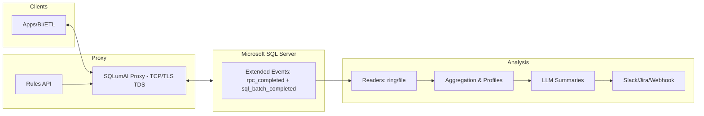

# Architecture

Notes
- Real‑time decisions in the proxy are deterministic (rules engine). No LLM calls happen on the hot path.
- LLM processing is asynchronous: scheduler jobs read aggregated data and generate insights and proposed rules.
